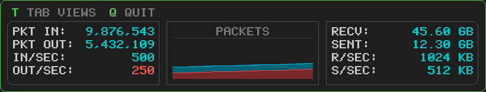

# Sixel Graphics Experiments

A collection of experiments and projects using [Sixel graphics](https://en.wikipedia.org/wiki/Sixel) - a bitmap graphics format for terminals.

Sixel allows rendering pixel-perfect graphics directly in terminal emulators that support it, without requiring a GUI framework.

## Projects

### Sixtop - System Monitor

A terminal-based system monitor with real-time updating graphs, similar to Activity Monitor or Task Manager.



**Features:**
- Five metric views: Energy, CPU, I/O, Memory, Network
- Real-time graphs with historical data
- Cross-platform support (Windows/macOS/Linux)
- Battery status and power monitoring

[See the Sixtop README for details](sixtop/README.md)

### Snake Game

A fully playable snake game rendered entirely in Sixel graphics, including a custom bitmap font for text rendering.


**Features:**
- Pure Sixel rendering (no ANSI text mixing)
- Custom 5x7 bitmap font
- Cross-platform support (Windows/macOS/Linux)
- 16x16 game grid with smooth graphics

[See the Snake README for details](snake/README.md)

## Terminal Compatibility

Sixel graphics require a compatible terminal emulator:

| Platform | Terminals |
|----------|-----------|
| **macOS** | iTerm2 |
| **Windows** | Windows Terminal, mintty (Git Bash) |
| **Linux** | mlterm, xterm (with Sixel enabled), foot, kitty |

### Testing Sixel Support

You can test if your terminal supports Sixel by running:

```bash
cat test.sixel
```

If you see colored horizontal bars, your terminal supports Sixel graphics.

## Repository Structure

```
sixel/
├── README.md          # This file
├── test.sixel         # Simple Sixel test file
├── sixtop/            # System monitor project
│   ├── README.md
│   ├── Makefile
│   ├── Pipfile
│   ├── main.py
│   ├── renderer.py
│   ├── sixel.py
│   ├── metrics.py
│   └── demo/
│       └── screenshot.png
└── snake/             # Snake game project
    ├── README.md
    ├── Makefile
    ├── Pipfile
    ├── main.py
    ├── game.py
    ├── sixel.py
    ├── renderer.py
    └── demo/
        └── sixel-snake.gif
```

## About Sixel

Sixel (short for "six pixels") is a graphics format that encodes images as sequences of characters. Each Sixel character represents a column of 6 vertical pixels, with a bitmask indicating which pixels are "on" for a given color.

Key characteristics:
- **6 pixels per character**: Each character encodes 6 vertical pixels
- **Multiple colors**: Colors are defined with RGB values (0-100 range)
- **Terminal-native**: No external graphics libraries needed
- **Streaming**: Can be output progressively

The format was originally developed by DEC for use with their terminals in the 1980s and has seen renewed interest for terminal-based graphics applications.
