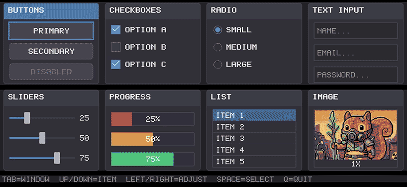

# GUI Demo - Sixel Interactive Components

A proof-of-concept interactive terminal GUI framework demonstrating rich UI components rendered entirely in the terminal using Sixel graphics. Features interaction for buttons, checkboxes, radio buttons, text inputs, sliders, progress bars, list boxes, and image display.



## Features

- **8 Demo Windows** showcasing different GUI components:
  - **Buttons**: Toggle press
  - **Checkboxes**: Toggle between checked/unchecked states
  - **Radio Buttons**: Mutually exclusive selection
  - **Text Input**: Click to focus, type to enter text with blinking cursor
  - **Sliders**: Click to adjust value
  - **Progress Bars**: Animated progress indicators with color states
  - **List Box**: Scrollable item selection
  - **Image Display**: Render PNG images with zoom controls

- **Keyboard Navigation**: Tab/Shift+Tab for window focus, arrow keys for component interaction
- **Async Rendering**: Background thread rendering for responsive input handling
- **Native iTerm2 Protocol**: Fast inline image rendering on macOS using JPEG encoding
- **SOLID Architecture**: Clean, extensible component design
- **YAML Configuration**: Build GUIs declaratively via config files with variable bindings
- **Cross-Platform**: Works on Linux, macOS, and Windows

## Requirements

- Python 3.13+
- Terminal with sixel support:
  - iTerm2 (macOS)
  - mlterm
  - xterm (compiled with +sixel)
  - Windows Terminal (with appropriate settings)

## Installation

```bash
# Install dependencies
make install

# Or for development
make install-dev
```

## Usage

```bash
# Run the GUI demo
make run

# Or directly
pipenv run python main.py
```

## Controls

- **Tab / Shift+Tab**: Navigate between windows
- **Arrow Keys**: Navigate components in window, adjust sliders, zoom in/out on images
- **Space / Enter**: Activate focused component
- **Keyboard**: Type in focused text inputs
- **Backspace**: Delete characters in text inputs
- **Q**: Quit the application

## Architecture

The project follows SOLID principles:

- **Single Responsibility**: Each component manages only its own state
- **Open/Closed**: New components can be added without modifying existing code
- **Liskov Substitution**: All components are interchangeable via the Component base class
- **Interface Segregation**: Separate protocols for Clickable, Focusable, ValueHolder
- **Dependency Inversion**: High-level modules depend on abstractions

### File Structure

```
gui/
├── main.py           # Entry point and demo setup
├── app_loop.py       # Main event loop with async rendering
├── renderer.py       # Sixel rendering for all components
├── gui.py            # Component classes and state management
├── sixel.py          # Sixel/iTerm2 encoding and drawing primitives
├── config.py         # YAML configuration system
├── terminals/        # Cross-platform terminal abstraction
│   ├── __init__.py   # Factory and registry
│   ├── base.py       # Abstract interfaces
│   ├── unix.py       # Unix/Linux/macOS implementation
│   └── windows.py    # Windows implementation
├── tests/            # Test suite
├── demo/             # Demo assets
│   └── squirel.png   # Sample image for Image Display
├── Makefile          # Build and test commands
└── Pipfile           # Dependencies
```

## Testing

```bash
# Run all tests
make test

# Run unit tests only
make unit

# Run visual tests only (with screenshots)
make e2e

# Run with coverage
make coverage
```

## Performance

The framework includes several optimizations for smooth rendering:

- **Async Rendering**: Background thread handles frame rendering without blocking input
- **State Hashing**: Only re-renders when component state actually changes
- **Native iTerm2 Protocol**: Uses inline image protocol with JPEG encoding on macOS for fast rendering
- **Platform-Aware Scaling**: 2x UI scale on macOS/iTerm2 for Retina displays, 1x elsewhere

## License

Part of the sixel project.
