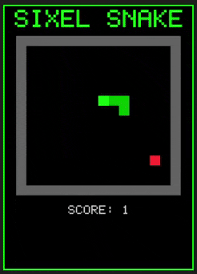

# Snake Game with Sixel Graphics

A classic snake game rendered entirely using Sixel graphics in the terminal.



## Requirements

- Python 3.13+
- A terminal that supports Sixel graphics:
  - **macOS**: iTerm2
  - **Windows**: Windows Terminal (with Sixel support), mintty (Git Bash)
  - **Linux**: mlterm, xterm (with Sixel enabled), foot, kitty

## Quick Start

```bash
cd snake
make install
make run
```

## Installation

1. Make sure you have Python 3.13 and pipenv installed:

   ```bash
   pip install pipenv
   ```

2. Install dependencies:

   ```bash
   make install
   ```

   Or manually:

   ```bash
   pipenv install
   ```

## Usage

Run the game:

```bash
make run
```

Or manually:

```bash
pipenv run python main.py
```

See all available commands:

```bash
make help
```

## Controls

| Key | Action |
|-----|--------|
| `W` / `Up Arrow` | Move up |
| `S` / `Down Arrow` | Move down |
| `A` / `Left Arrow` | Move left |
| `D` / `Right Arrow` | Move right |
| `R` | Restart game (after game over) |
| `Q` / `Ctrl-C` | Quit |

## Project Structure

```
snake/
├── Makefile       # Build commands (install, run, clean, help)
├── Pipfile        # Python dependencies
├── main.py        # Entry point and configuration
├── game.py        # Snake game logic (state, rules, collision)
├── sixel.py       # Sixel graphics generation with bitmap font
├── terminal.py    # Terminal handling and game loop
├── demo/          # Demo assets
│   └── sixel-snake.gif
└── README.md      # This file
```

## Module Overview

- **sixel.py**: Pure Sixel encoding with proper 6-pixel vertical banding, color palette support, pixel buffers, bitmap font rendering, and sixel string generation. Can be reused for other Sixel-based projects.

- **game.py**: Game state and rules including snake movement, collision detection, food spawning, and scoring. Independent of rendering.

- **terminal.py**: Terminal configuration, keyboard input handling (cross-platform), and the main game loop. Renders everything as a single sixel image per frame.

- **main.py**: Entry point that ties everything together with game configuration.

## Troubleshooting

### Game doesn't display correctly

Make sure your terminal supports Sixel graphics. You can test by viewing the `test.sixel` file in the parent directory:

```bash
cat ../test.sixel
```

If you see colored bars, your terminal supports Sixel.

### Arrow keys don't work

Some terminals may not send standard escape sequences. Use WASD keys instead.

### Terminal is messed up after exiting

If the game crashes or exits unexpectedly, your terminal may be stuck in raw mode. Run:

```bash
reset
```
